# ESXi-Client-Integration-Plug-In-with-vSphere-Web-Client-6.x
<!-- https://www.opvizor.com/get-the-client-integration-plug-in-running-in-vsphere-web-client-6-x -->
Get the Client Integration Plug-In running in vSphere Web Client 6.x

# Install Firefox
Unfortunately, It´s not possible anymore to enable NPAPI using a Firefox version older than 52. Therefore, we need to install Firefox 52 first and uninstall any newer Version. Please be aware that Firefox autoupdates by default, so more often than not, you need to uninstall first to install an older version.

Just to make sure, you´re going to use an outdated technology. But its the only way I found that always works.

You might want to consider the Firefox Extended Support Edition that is community driven and supports NPAPI 12 month longer. https://www.mozilla.org/en-US/firefox/organizations/

Download Firefox version 52 for your OS here: https://ftp.mozilla.org/pub/firefox/releases/52.0/ and install the software. Please make sure to disable the maintenance service in the installation wizard.

  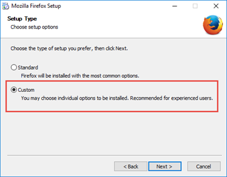

Select Custom during the installation and disable the “Install Maintenance Service” Box.

  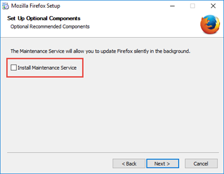

## Change Update Settings
First thing to change after the first launch is the update setting.

  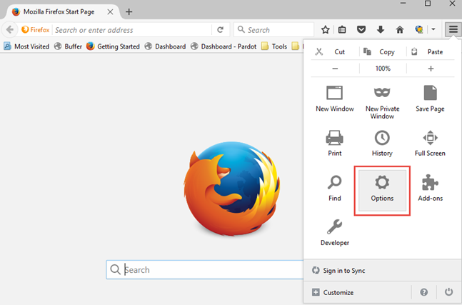

Click the icon top right and select Options.

  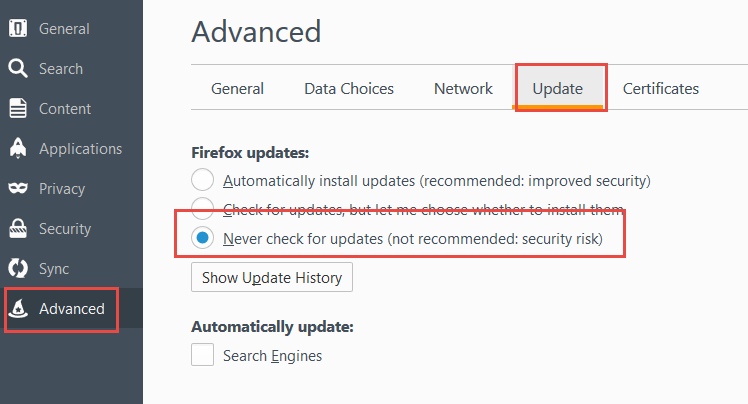

Disable the automatic update.

## Firefox setting to enable NPAPI
To change the NPAPI settings in Firefox and enable Flash, Silverlight plugins, just type about:config to open the advanced settings.

  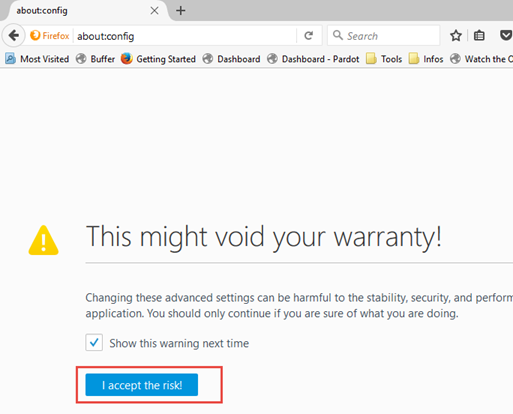

Accept the risk and continue to the settings page. Then right click into the list and select New-Boolean

  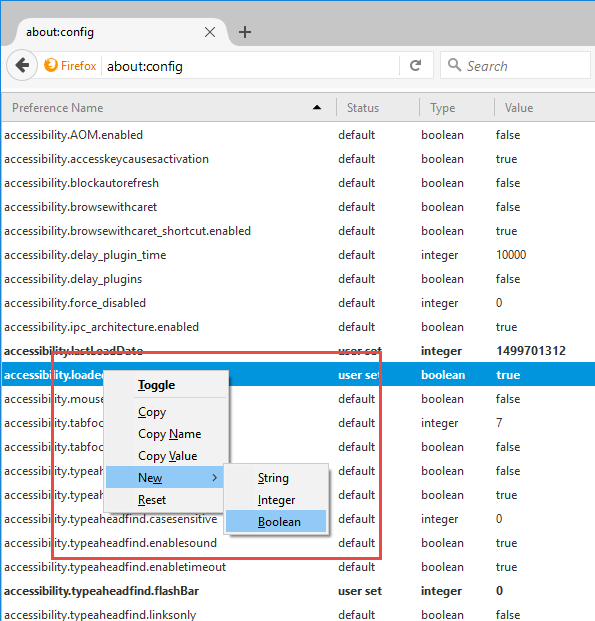

Type in `plugin.load_flash_only` and select `false`.

  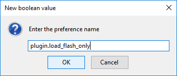

  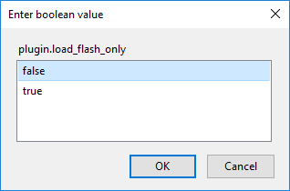

Then restart Firefox.

# Install Flash
Make sure to install Flash.

  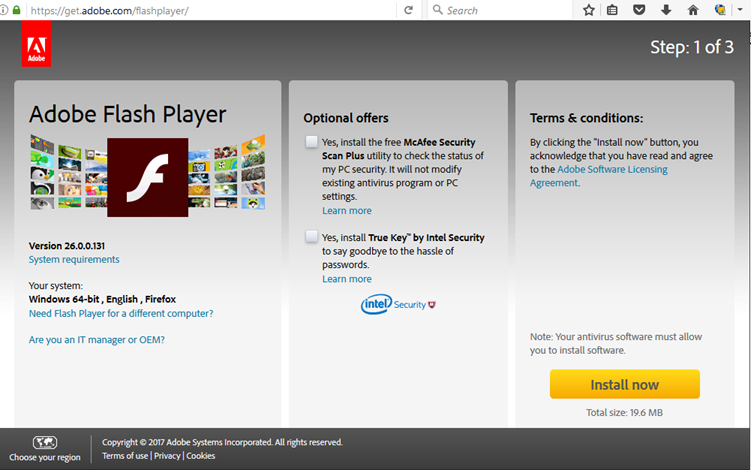

# Install Client Integration Plugin
Visit your VMware vCenter Web Client and install the Client integration plugin (best is to start Firefox using an administrative account).

  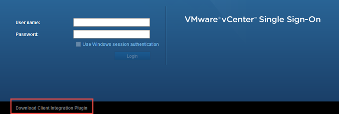

  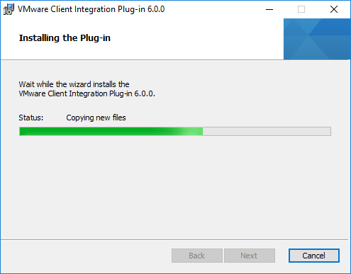

When everything has been installed successful, you can log into your VMware vSphere Web client and use Client Integration plugin functions like Deploy OVF.

  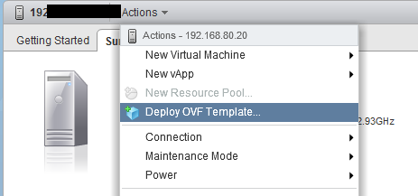

Just make sure to allow the Plugin to do its job, by clicking allow for the https protocol access.

That’s it and you should have all up and running.
